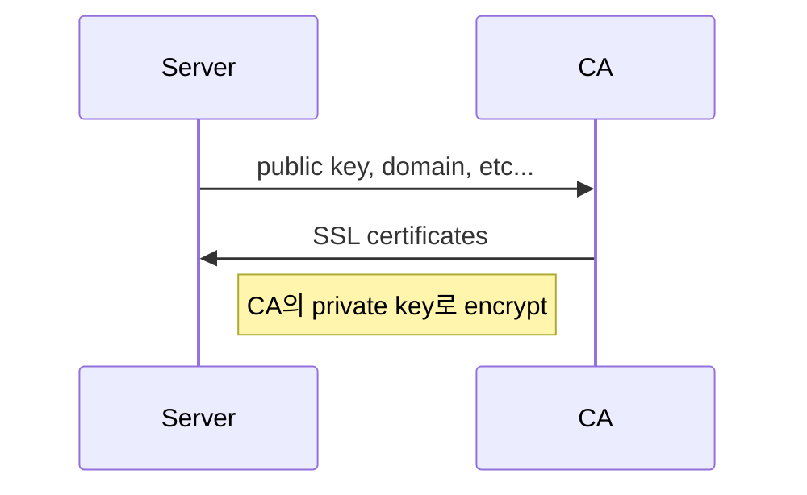
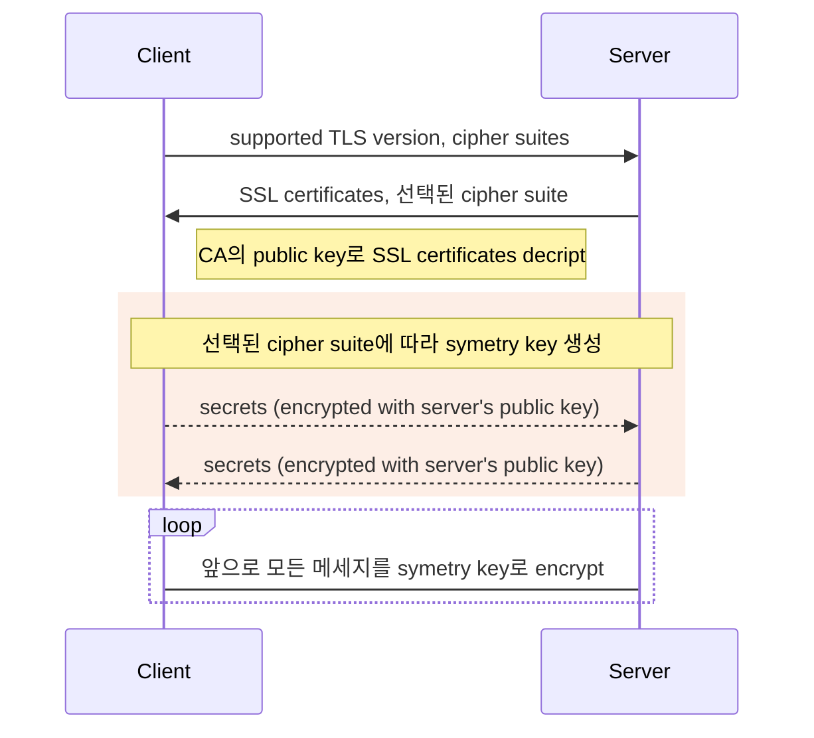

## Same origin policy

모든 웹 보안의 근간을 이루는 규칙이다. 브라우저에서는 현재 페이지의 [origin](#origin)과 같은 origin을 가진 resource에만 접근 가능하다.

### origin

(`protocol`, `host`, `port`) tuple

**Example**

```
https://niceandneat.dev/about
```

- `protocol` : https
- `host` : niceandneat.dev
- `port` : 443 (https defualt port)

### cross origin access

만약 현재 페이지의 origin과 다른 origin을 가진 resource에 접근한다면? 엄밀하게는 막는 것이 맞겠지만 현실은 그렇지 못하기에 예외를 두었다. 접근 방식에 따라 될 수도 안될 수도 있다.

**되는 것의 예**

- `<image>`, `<script>`, `<iframe>` 태그 등에 embedding
- `<form>`의 `action` attribute를 통한 writing

**안되는 것의 예**

- `XMLHttpRequest`, `fetch` 등의 API 호출을 통한 reading
- script 내부에서 `src` attribute 변경을 통한 reading
- `<iframe>` 내부 요소 접근을 통한 reading

서버에서의 HTTP response header 값에 따라 되는 것이 안될 수도, 안되는 것이 될 수도 있다.

## Cross Origin Resource Sharing

[Same origin policy](#same-origin-policy)에 의해 브라우저에서는 다른 origin을 가진 resource를 읽어오는 것이 기본적으로 금지되어있다. 하지만 이를 완화할 수 있는 방법이 있다. 서버에서 몇몇 HTTP response header들을 이용해 클라이언트가 접근할 수 있는 resource들을 설정할 수 있다. 이 메커니즘을 **Cross Origin Resource Sharing(CORS)** 라고 한다. requests의 종류에 따라 처리하는 방법이 조금 다른데 아래에서 이를 설명한다.

### Simple requests

**조건**

- method는 다음만 허용 : `GET`, `HEAD`, `POST`
- header는 다음만 허용 : `Accept`, `Accept-Language`, `Content-Language`, `Content-Type` (브라우저에서 request시 생성하는 header 제외)
- `Content-Type` header값은 다음만 허용 : `application/x-www-form-urlencoded`, `multipart/form-data`, `text/plain`

서버의 `Access-Control-Allow-Origin` header value가 `*` 이거나 request한 origin과 같을 때 response를 받을 수 있다.

**예**

```
Request

GET /assets/image.png HTTP/1.1
Origin: https://niceandneat.dev
Accept: image/*
Accept-Encoding: gzip, deflate, br
Accept-Language: ko-KR,ko;q=0.9,en-US;q=0.8,en;q=0.7

---
Response

HTTP/1.1 200 OK
Access-Control-Allow-Origin: *
Content-Type: image/png

...Data...
```

> Request의 `Origin` header는 브라우저에서 추가해준다.

### Preflighted requests

**조건**

- [Simple requests](#simple-request)를 제외한 모든 requests

[Simple requests](#simple-request)와 달리 실제 request를 처리하기 전에 `OPTIONS` method를 가지는 **preflighted** request를 먼저 전송한다. 이 때 서버는 `Access-Control-Allow-Origin`, `Access-Control-Allow-Methods` 와 같이 서버가 미리 설정해둔 CORS 조건을 나타내는 header들을 response로 전송한다. 만약 원래의 request가 해당 조건을 만족한다면 그재서야 원래의 실제 request를 전송한다.

**예**

```
Preflighted Request

OPTIONS /assets/image.png HTTP/1.1
Origin: https://niceandneat.dev
Accept: image/*
Accept-Encoding: gzip, deflate, br
Accept-Language: ko-KR,ko;q=0.9,en-US;q=0.8,en;q=0.7
Access-Control-Request-Method: GET
Access-Control-Request-Headers: X-CUSTOM_HEADER, Content-Type

---
Preflighted Response

HTTP/1.1 204 No Content
Access-Control-Allow-Origin: *
Access-Control-Allow-Methods: POST, GET, OPTIONS
Access-Control-Allow-Headers: X-PINGOTHER, Content-Type
Access-Control-Max-Age: 86400

---
Request

GET /assets/image.png HTTP/1.1
Origin: https://niceandneat.dev
Accept: image/*
Accept-Encoding: gzip, deflate, br
Accept-Language: ko-KR,ko;q=0.9,en-US;q=0.8,en;q=0.7
X-CUSTOM_HEADER: custom-value
Content-Type: image/png

---
Response

HTTP/1.1 200 OK
Access-Control-Allow-Origin: *
Content-Type: image/png

...Data...
```

### Request headers

브라우저에서 자동으로 설정해주므로 보통 직접 다룰일은 없다.

- [Origin](https://developer.mozilla.org/en-US/docs/Web/HTTP/Headers/Origin) : request한 페이지의 origin.
- [Access-Control-Request-Method](https://developer.mozilla.org/en-US/docs/Web/HTTP/Headers/Access-Control-Request-Method) : _(preflight 전용)_ request한 method.
- [Access-Control-Request-Headers](https://developer.mozilla.org/en-US/docs/Web/HTTP/Headers/Access-Control-Request-Headers) : _(preflight 전용)_ simple request 조건에서 벗어난 header key 값들.

### Response headers

- [Access-Control-Allow-Origin](https://developer.mozilla.org/en-US/docs/Web/HTTP/Headers/Access-Control-Allow-Origin) : 서버에서 CORS를 허락하는 origin. 하나의 origin만을 값으로 가질 수 있으므로 서버에서 허용되는 host 리스트를 관리하고 있다가 해당 host에서 request가 왔을 때 header를 만들어주는 로직이 필요하다. 이때 `Vary` header의 값에 `Origin`을 추가해 브라우저가 origin마다 다른값을 캐싱하도록 해야한다. `*` 로 설정해두면 모든 origin을 허용한다.
- [Access-Control-Allow-Credentials](https://developer.mozilla.org/en-US/docs/Web/HTTP/Headers/Access-Control-Allow-Credentials) : `fetch`의 `credentials: 'include'` 옵션 등을 이용해 credential 정보를 request header에 함께 전송한다면 서버에서 response의 이 header의 값을 `true`로 설정해야 브라우저에서 response를 사용하게 해준다. 이때 `Access-Control-Allow-Origin`의 값은 `*`가 아닌 request한 페이지의 origin이어야 한다.
- [Access-Control-Expose-Headers](https://developer.mozilla.org/en-US/docs/Web/HTTP/Headers/Access-Control-Expose-Headers) : 페이지에서 실행되는 Javascript에서 접근할 수 있는 header들을 설정.
- [Access-Control-Allow-Methods](https://developer.mozilla.org/en-US/docs/Web/HTTP/Headers/Access-Control-Allow-Methods) : _(preflight 전용)_ 허용된 request method들.
- [Access-Control-Allow-Headers](https://developer.mozilla.org/en-US/docs/Web/HTTP/Headers/Access-Control-Allow-Headers) : _(preflight 전용)_ 허용된 request header들.
- [Access-Control-Max-Age](https://developer.mozilla.org/en-US/docs/Web/HTTP/Headers/Access-Control-Max-Age) : _(preflight 전용)_ preflight request 결과 캐시 기간 설정.

## Content Security Policy

브라우저에서 실행되거나 사용될 수 있는 resource들을 host에 따라 제한할 수 있다. [Same origin policy](#same-origin-policy)나 [CORS](#cross-origin-resource-sharing)에 의해 허용된 resource들 뿐만아니라 HTML안에있는 inline 스크립트의 실행 또한 제한할 수 있다. [XSS](#cross-site-scripting-xss-)를 막는데에 주 목적이 있다.

서버 response의 [Content-Security-Policy](https://developer.mozilla.org/en-US/docs/Web/HTTP/Headers/Content-Security-Policy) header로 설정이 가능하다. `script-src`, `style-src` 등 원하는 resource 종류에 따라 다른 policy를 설정할 수 있고 `default-src`로 *대부분*의 reource(_모든_ resource는 [아니다](https://developer.mozilla.org/en-US/docs/Web/HTTP/Headers/Content-Security-Policy/default-src))에 대해서 fallback을 설정할 수도 있다. 따로 policy를 설정하지 않는다면 `*` 을 기본값으로 가진다. 기본적으로 inline script, style의 실행은 막혀있지만 `'unsafe-inline'` keyword를 통해 허용할 수 있다. 이 때 `nonce-` keyword나 `sha256-` 등의 hash keyword를 사용하면 inline 실행되는 스크립트를 제한할 수 있다. `report-uri` keyword를 사용하면 뒤에오는 URL로 제한된 요청 정보를 JSON POST 로 받아볼 수있다. `Content-Security-Policy-Report-Only` header를 사용하면 실제로 접근을 제한하지 않고 조건에 걸리는 요청에 대한 report만 받아볼 수 있다.

CSP는 새로운 execution context를 만드는 resource들(예: HTML document, Web worker를 실행시키는 스크립트, `<iframe>`에 embedding되는 페이지 등)에만 적용된다. 즉 일반 스크립트 파일이나 이미지 파일등에는 `Content-Security-Policy` header를 넣어도 효과가 없으니 보통은 새로 로드되는 HTML에만 신경써서 넣어주면 된다. ([참고](https://stackoverflow.com/questions/37819249/what-does-it-mean-to-set-a-content-security-policy-on-response-to-a-non-html-req/37819481#37819481))

**예**
다
해당 페이지와 같은 origin을 가지는 resource들만 허용.

```
Content-Security-Policy: default-src 'self'
```

`https://safe.com`에서 들어오는 `script`, `style`을 제외하고는 모두 제한. 하지만 `image`는 모두 허용.

```
Content-Security-Policy: default-src 'none'; script-src https://safe.com; style-src https://safe.com; img-src *;
```

요청에 제한을 두진 않지만 https가 아닌 resource 요청들을 `/report-endpoint/`로 report.

```
Content-Security-Policy-Report-Only: default-src https:; report-uri /report-endpoint/
```

## Recommended Headers

### Strict-Transport-Security

앞으로 브라우저에서 HTTP 요청을 했을 때 대신 HTTPS 요청을 하도록 만든다.

지금 이 블로그를 예로 들어보자. 현재 이 블로그는 HTTPS를 통해서만 파일들을 호스팅하고 있지만 HTTP 요청도 허용을 해야하기 때문에 HTTP 요청이 들어왔을 경우 같은 URL의 HTTPS 요청으로 redirect 시키고있다. 하지만 이 과정에서 헤커가 HTTP 요청을 가로채 유저에게 다른 페이지로 redirect 시키는 response를 보낼 수 있다. [Strict-Transport-Security](https://developer.mozilla.org/en-US/docs/Web/HTTP/Headers/Strict-Transport-Security) response header를 사용하면 브라우저가 HTTPS를 통해 받은 이 header를 기억해 앞으로 해당 도메인으로의 요청은 모두 HTTPS로 강제한다. 즉 유저가 HTTP로 요청하더라도 브라우저 내부에서 HTTPS로 변경해 서버에 요청한다.

**예**

```
Strict-Transport-Security: max-age=63072000; includeSubDomains; preload
```

- `max-age` : 브라우저가 header를 기억하고 있을 시간 (초단위)
- `includeSubDomains` : 해당 도메인의 서브 도메인들까지 포함할지 여부
- `preload` : [HSTS preload list](https://hstspreload.org/)에 포함시켜 앞으로 모든 브라우저에서 HSTS를 적용한다.

### X-Frame-Options

페이지가 `<iframe>`으로 load될 수 있는지 여부를 제한할 수 있다.

[X-Frame-Options](https://developer.mozilla.org/en-US/docs/Web/HTTP/Headers/X-Frame-Options) response header로 브라우저의 동작을 제어할 수 있다. keyword는 `DENY`와 `SAMEORIGIN` 두가지를 제공한다. `DENY`는 말그대로 `<iframe>`안에 들어가는 것 자체를 금지시킨다. `SAMEORIGIN`은 같은 origin을 가진 페이지에서만 허락한다. [Content Security Policy](#content-security-policy)의 `frame-ancestors` 옵션이 이 header보다 더 우선권을 가진다. 하지만 지원하지 않는 브라우저도 있으므로 둘 다 사용하는 것이 바람직하다.

**예**

```
Content-Security-Policy: frame-ancestors 'self'
X-Frame-Options: SAMEORIGIN
```

### X-XSS-Protection

브라우저가 [XSS](#cross-site-scripting-xss-) 공격을 감지하면 페이지 load를 막게한다.

최신 브라우저에서는 [Content Security Policy](#content-security-policy) header를 사용하고 `unsafe-inline` 옵션을 적용하지 않거나 domain을 제한하면 된다. 하지만 아직 CSP를 지원하지 않는 브라우저들의 XSS 공격을 막기위해 사용된다. `X-XSS-Protection` response header의 값으로 `1`을 설정하면 브라우저가 XSS가 감지된 페이지를 sanitize한다. `mode=block` 옵션을 추가하면 공격이 감지되었을 경우 아예 페이지를 rendering를 하지 않는다.

**예**

```
X-XSS-Protection: 1; mode=block
```

### X-Content-Type-Options

브라우저가 reource의 MIME type을 [sniffing](https://developer.mozilla.org/en-US/docs/Web/HTTP/Basics_of_HTTP/MIME_types#mime_sniffing)하지 않고 `Content-Type` header를 그대로 사용하도록 한다.

[X-Content-Type-Options](https://developer.mozilla.org/en-US/docs/Web/HTTP/Headers/X-Content-Type-Options) response header의 값을 `nosniff`로 설정하면 브라우저에서 resource의 MIME type을 바꾸지 않도록 한다. 추가로 `<style>` 요청의 MIME type이 `text/css`가 아니거나 `<script>` 요청의 MIME type이 javascript가 아니라면 요청을 막는다.

**예**

```
X-Content-Type-Options: nosniff
```

### Referrer-Policy

브라우저에서 request에 자동으로 넣어주는 [Referer](https://developer.mozilla.org/en-US/docs/Web/HTTP/Headers/Referer) header에 어떤 값이 들어갈 지 설정한다.

[Content Security Policy](#content-security-policy) header와 마찬가지로 page단위로 적용된다. [Referrer-Policy](https://developer.mozilla.org/en-US/docs/Web/HTTP/Headers/Referrer-Policy) response header의 값에 따라 브라우저에서 `Referer`를 어떻게 설정할지 달라진다. 자세한 옵션은 [web.dev](https://web.dev/referrer-best-practices/) 참조.

**예**

```
Referrer-Policy: strict-origin-when-cross-origin
```

## Famous Attacks

### Cross Site Scripting (XSS)

injection의 일종으로 attacker가 임의의 코드를 공격을 원하는 origin을 가진 website를 통해 다른 유저의 브라우저에서 실행시키는 공격이다. 이 때 실행되는 스크립트는 해당 페이지를 사용하는 유저의 모든 cookie, localStorage 등에 접근할 수 있기 때문에 개인정보 열람과 같은 일들을 할 수 있다. 보통 user의 input으로 받은 데이터를 웹에 보여줄 때 발생한다.

**예방 방법**

- 외부에서 들어오는 모든 data는 사용하기 전에 sanitize한다.
- [Content Security Policy](#content-security-policy)를 사용한다.
- [OWASP Cheat Sheet](https://cheatsheetseries.owasp.org/cheatsheets/Cross_Site_Scripting_Prevention_Cheat_Sheet.html)

### Cross Site Request Forgery (CSRF)

유저의 authentication 정보를 이용해 원하지 않는 action을 실행시키는 공격이다. 예를 들어 페이지 안에 보이지 않는 `<form>`을 넣고 `submit` 버튼을 클릭하게해 유저가 자신의 은행 인증정보를 이용해 attacker의 계좌로 입금할 수 있다. 공격을 위해 위에서 살펴본 [XSS](#cross-site-scripting-xss-)를 사용하기도 한다.

**예방 방법**

- `Set-Cookie` header의 `SameSite` 옵션을 사용한다.
- 데이터를 update하는 `<form>`을 만들때에는 서버에서 만든 `token`을 함께 전송해서, 유저가 post할 때 같은 `token`을 동봉하도록 한다.
- [OWASP Cheat Sheet](https://cheatsheetseries.owasp.org/cheatsheets/Cross-Site_Request_Forgery_Prevention_Cheat_Sheet.html)

## HTTPS

### SSL Certificates 발급



SSL certificates에는 Server의 _public key_, domain 등이 CA(Certificate Authority)의 _private key_ 로 암호화되어 들어있다.

### HTTPS Proccess



브라우저에 미리 등록되어있는 CA의 _public key_ 를 이용해 SSL certificates를 복호화한다. 복호화에 성공하면 정상적인 인증서로 판단하고 들어있던 Server의 _public key_ 를 이용해 선택된 cipher suite에 맞는 방법으로 _symetry key_ 를 생성한다. 이 _symetry key_ 를 이용해 앞으로 Client-Server 간의 통신을 암호화, 복호화한다.

## References

- [MDN HTTP](https://developer.mozilla.org/en-US/docs/Web/HTTP)
- [MDN Web Security](https://developer.mozilla.org/en-US/docs/Web/Security)
- [Mozilla web security guidelines](https://infosec.mozilla.org/guidelines/web_security)
- [WebFundamentals Security](https://developers.google.com/web/fundamentals/security)
- [Safe and secure on web.dev](https://web.dev/secure/)
- [Attacks on OWASP](https://owasp.org/www-community/attacks/)
- [OWASP Cheatsheets](https://cheatsheetseries.owasp.org/)
